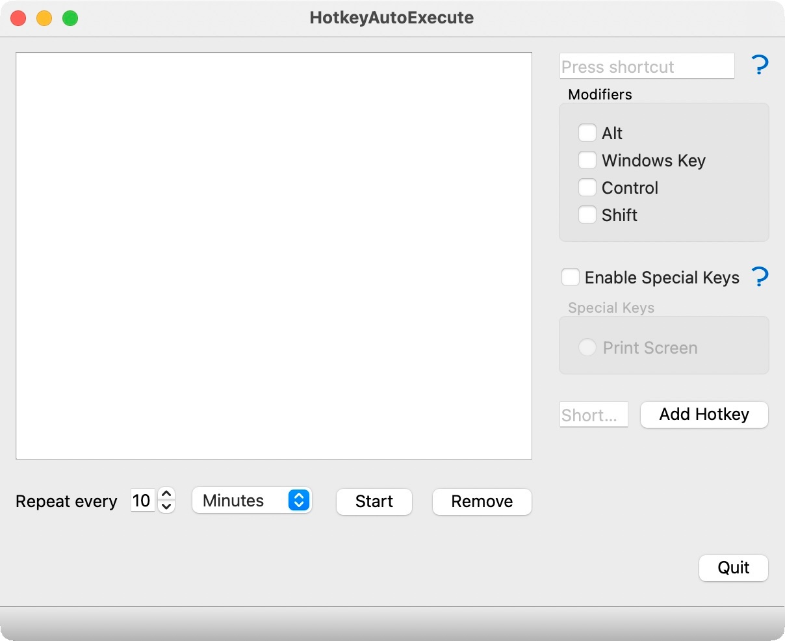

HotkeyAutoExecute
=================

HotkeyAutoExecute is a simple single-window tool that lets you manage a list of
frequently used hotkeys, of which one is repeatedly executed in configurable
intervals.

That was the TLDR blurp, and now let’s get into the details.

This tool scratches an itch I had in 2020 when I wanted to simplify the process
of taking game screenshots for my reviews. During intense gameplay moments, it
is difficult to focus on the game and press a keyboard shortcut to take an image
of on-screen action. Therefore, [I hacked something that would do the job][agsc]
but was not quite baked to be released as an application. I have changed that
now, and boy, was it more complicated than I would have liked.

## Brief Walkthrough

Let me quickly show you a screenshot of the application and explain what it
does. For its limited purpose, I have definitely put way too much work into it.
I literally only require one hotkey to serve all my needs, but hey, sometimes
you gotta do what you gotta do.

The first thing to do is define the keyboard shortcut, the hotkey, that you want
to be pressed repeatedly. There is an input box at the top right of the window
for that. The hotkey cannot be recorded in some situations because it is
immediately intercepted and eaten by the operating system or application.
NVIDIA’s screen capture and Windows’ integrated Xbox Game Bar are guilty as
charged. The latter is why it got so complicated and I only hacked something in
the first place.

In that case, you can manually select the modifier keys using the checkboxes and
only enter a single key in the input field. This is how I specify the NVIDIA
hotkey (ALT+F12). Xbox is all special handling as you cannot (or I have not
found out how) change the key combination - at all. The PRINT key is also up for
individual selection as a result.

Finally, give your baby a name and add it to the list. The application saves all
hotkeys to a JSON file that you can find in a hidden folder in your user
profile. Go to `%APPDATA%\The-Codeslinger\HotkeyAutoExecute`, and you’ll be
rewarded with a collectible.

Once you have created your collection of hotkeys, select the one you want to
emulate, specify the interval in seconds or minutes, click “Start”, and thy will
be done.

A couple of important things to note here:

* Only one hotkey can be active at any time.
* If the process receiving the hotkey is an admin process, it will not work.

The second point is crucial because it is a [security consideration in the
Windows API][sndi] and limits its use in some scenarios.

> Applications are permitted to inject input only into applications that are at
> an equal or lesser integrity level.

This is important because applications like MSI Afterburner cannot be triggered
with HotkeyAutoExecute. Even starting it with administrative privileges did not
help. This would have been my preferred solution, but I have not yet found a way
to make it work.

## Technical Stuff

Do not let the screenshot fool you into thinking HotkeyAutoExecute is
multi-platform. It has a monogamous relationship with the Windows operating
system, and the screenshot was taken using the preview feature of Qt Creator on
macOS. I have tested it on Windows 11, and I am confident it will work on
Windows 10 as well. I developed the initial solution on Windows 10, after all.

The basis of this little utility is the Qt framework in version 6.3, and the
compiler of choice is the MinGW suite of tools.

There is some technical drama to the implementation, and the story behind that
can be found in a blog post (TODO).

## A Peek Into the Crystal Ball

What does the future hold for HotkeyAutoExecute?

I cannot say. Right now, it does exactly what I need, and it took me two years
since my first attempt to solve the problem before I added some polish to it.
Nevertheless, it can still benefit from a few sprinkles of love here and there.
For example, while writing this blog post, I noticed that the window still says
“Main Window” instead of HotkeyAutoExecute 🤦. The application does not have an
icon, and the question mark icons I use for help I have repurposed verbatim from
my [WorkTracker][wrkt] utility.

Maybe I could find a way to improve the UX or do some refactoring to make it at
least compilable on other platforms. This way, I could develop visual features
without needing my Windows box.

Because of these minor flaws, I did not yet give it a 1.0 version number. It is
0.8.0 for now.

[agsc]: https://the-codeslinger.com/2020/08/15/automate-game-screenshot-capture-windows-api-sendinput-function-with-c/
[sndi]: https://docs.microsoft.com/en-us/windows/win32/api/winuser/nf-winuser-sendinput#remarks
[wrkt]: https://github.com/the-codeslinger/WorkTracker